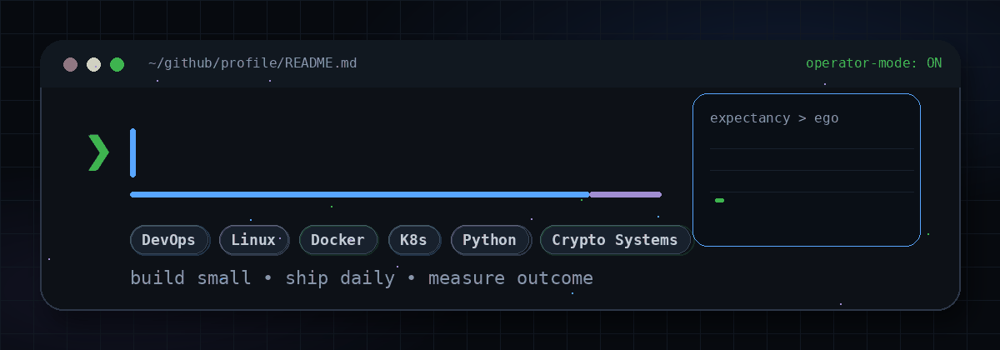
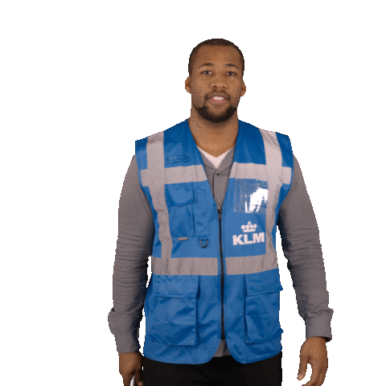
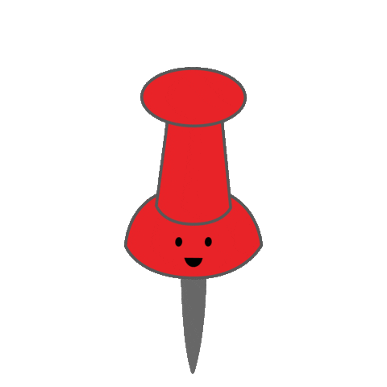

---

I build practical tools around **DevOps, automation, trading systems, and developer workflows**.

--- 

My approach is simple:  


---

##  Current Focus

- Building trading tools for Solana memecoin analysis and decision support
- Learning DevOps through practical projects instead of pure theory
- Working with Docker, Linux, GitHub, CI/CD, monitoring, and cloud basics
- Improving automation, documentation, and clean execution systems

---

##  Featured Projects

### [`narrative-hud`](https://github.com/lotoos0/narrative-hud)

A browser-based HUD for structured narrative analysis and trading decision support.

Focus areas:

- decision checklists
- session flow
- manual scoring
- lightweight trading workflow support

---

### [`memex-sim`](https://github.com/lotoos0/memex-sim)

A DEX trading simulator built with React and TypeScript.

Focus areas:

- chart simulation
- market events
- trading practice environment
- realistic execution training

---

### [`sol_hud`](https://github.com/lotoos0/sol_hud)

An Electron overlay/HUD for Solana trading sessions.

Focus areas:

- desktop overlay
- trade discipline tools
- gamified execution
- session tracking

---

##  Tech Stack

```txt
Linux · Git · GitHub · Docker · CI/CD · Python · JavaScript · TypeScript · React
````

Also exploring:

```txt
Kubernetes · Terraform · AWS · Prometheus · Grafana · Bash automation
```

---

##  How I Work

* I prefer practical projects over theory
* I like small, testable slices of work
* I document problems, decisions, and fixes
* I use checklists and systems to reduce chaos
* I focus on building repeatable workflows

---

##  Direction

I am currently developing my skills toward:

* DevOps / Cloud Engineering
* automation-heavy workflows
* clean project documentation
* trading-related tools and dashboards
* systems that support better decision-making

---

##  Contact

You can reach me through GitHub or email:

```txt
lotoos1998@gmail.com
```
