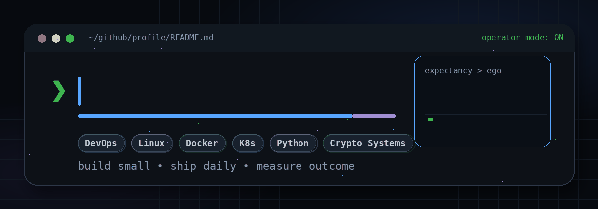
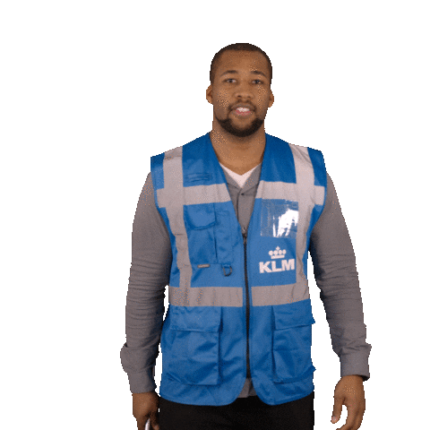
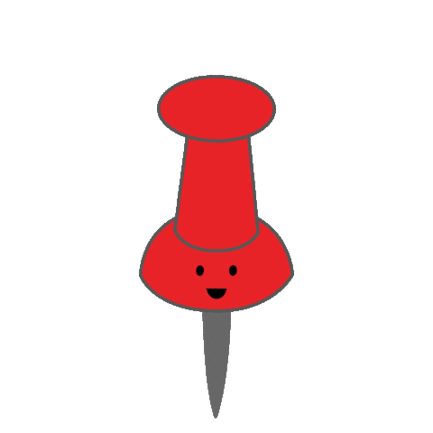

---

I build practical tools around **DevOps, automation, trading systems, and developer workflows**.

--- 

My approach is simple:  


---

##  Current Focus

- Building trading tools for Solana memecoin analysis and decision support
- Learning DevOps through practical projects instead of pure theory
- Working with Docker, Linux, GitHub, CI/CD, monitoring, and cloud basics
- Improving automation, documentation, and clean execution systems

---

##  Latest  Projects

### [`resilience-lab`](https://github.com/lotoos0/resilience-lab)

A long-term DevOps/SRE lab for building, breaking, observing, and improving a Kubernetes-based microservice system.

Focus areas:

* Kubernetes deployments and Helm-based configuration
* microservice resilience patterns
* Prometheus, Grafana, metrics, and alerting
* runbooks and troubleshooting documentation
* CI/CD, testing, and production-like debugging workflow

---


### [`memex-sim`](https://github.com/lotoos0/memex-sim)

A DEX trading simulator built with React and TypeScript.

Focus areas:

- chart simulation
- market events
- trading practice environment
- realistic execution training

---

### [`sol_hud`](https://github.com/lotoos0/sol_hud)

An Electron overlay/HUD for Solana trading sessions.

Focus areas:

- desktop overlay
- trade discipline tools
- gamified execution
- session tracking

---

##  Tech Stack

**Core**
Linux (Arch) · Git · Docker · Python · Bash · TypeScript · React

**DevOps & Infrastructure**
Kubernetes · Helm · Terraform · AWS · GitLab CI/CD · GitHub Actions

**Observability & Resilience**
Prometheus · Grafana · Envoy · Chaos Engineering

**Exploring**
FastAPI deeper · Cloud-native patterns · IaC at scale

**Side Projects**
Solana trading tooling · DeFi data pipelines · on-chain analytics (JS/TS)

---

##  How I Work

Practical over theoretical. Small slices, clear completion criteria.
Document decisions, not just results. Systems over willpower.

---

##  Direction

Transitioning into DevOps / Cloud Engineering — building toward infrastructure 
that's observable, resilient, and automated by default.

Parallel track: decision-support tooling for high-noise environments 
(currently: crypto trading dashboards and on-chain analytics).

I'm drawn to systems where the feedback loop is fast and the cost of being 
wrong is visible.

---

##  Contact

You can reach me through GitHub or email:

```txt
lotoos1998@gmail.com
```
