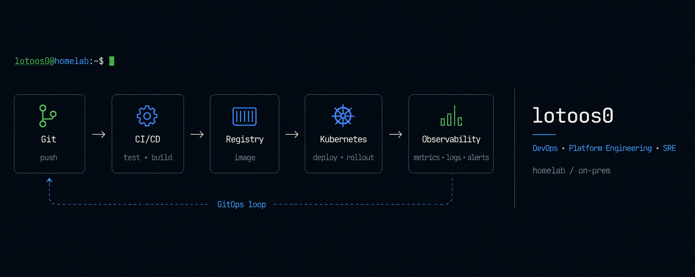

<p align="center">
  
</p>

<h1 align="center">Tomasz <code>/lotoos0</code></h1>

<p align="center">
  <strong>DevOps · SRE · Automation</strong><br />
  I build practical systems that make failure visible, operations repeatable,<br />
  and noisy data easier to act on.
</p>

<p align="center">
  <a href="https://www.linux.org/"></a>
  <a href="https://www.docker.com/"></a>
  <a href="https://kubernetes.io/"></a>
  <a href="https://www.python.org/"></a>
  <a href="https://www.typescriptlang.org/"></a>
</p>

---

## Featured systems

### [`resilience-lab`](https://github.com/lotoos0/resilience-lab)

**Reliability · SRE · failure engineering**

A Kubernetes sandbox where I build, break, observe, and improve a production-shaped microservice system. It combines FastAPI services, Redis, Envoy resilience policies, Kubernetes and Helm with Prometheus, Grafana, Loki, alerts, and operational runbooks.

**Current state:** `v0.1.0 released` · end-to-end stack validated · resilience experiments documented

`Kubernetes` `Helm` `FastAPI` `Envoy` `Prometheus` `Grafana` `Loki` `GitHub Actions`

### [`gitops-cloud-lab`](https://github.com/lotoos0/gitops-cloud-lab)

**GitOps · delivery · promotion · rollback**

A local-first lab that moves one FastAPI service through a complete, traceable delivery loop: GitHub Actions → GHCR → Git → Argo CD → Kubernetes. Dev updates automatically; production promotion stays an explicit pull-request decision.

**Current state:** `scope complete` · two environments · promotion, rollback, and failure paths documented

`kind` `GitHub Actions` `GHCR` `Helm` `Argo CD` `Kubernetes`

---

## Other things I build

<table>
  <tr>
    <td width="50%" valign="top">
      <h3><a href="https://github.com/lotoos0/memex-sim">memex-sim</a></h3>
      <p>A DEX-style trading simulator for practicing execution against synthetic OHLC data, market events, positions, and persistent PnL.</p>
      <p><code>React</code> <code>TypeScript</code> <code>Zustand</code> <code>Lightweight Charts</code></p>
    </td>
    <td width="50%" valign="top">
      <h3><a href="https://github.com/lotoos0/sol_hud">sol_hud</a></h3>
      <p>An Electron overlay for Solana trading sessions: discipline tools, session tracking, and gamified execution in one focused HUD.</p>
      <p><code>Electron</code> <code>JavaScript</code> <code>Trading tooling</code></p>
    </td>
  </tr>
</table>

## Current signal

- Hardening `resilience-lab` after v0.1.0 and documenting operational recovery paths.
- Building decision-support tools for high-noise on-chain and trading workflows.

## Toolbox

| Build | Operate | Observe | Deliver |
| --- | --- | --- | --- |
| Python, FastAPI | Linux, Docker | Prometheus, Grafana | Git, GitHub Actions |
| TypeScript, React | Kubernetes, Helm | Loki, Envoy | GitLab CI/CD |
| Bash, automation | Terraform, AWS | Chaos engineering | Tests, docs, runbooks |

## Operating principles

```text
01  Ship small slices with clear completion criteria.
02  Measure the system, not the intention.
03  Document decisions and recovery paths.
04  Prefer repeatable systems over heroic effort.
```

## Say hello

<p>
  <a href="mailto:lotoos1998@gmail.com"></a>
  <a href="https://github.com/lotoos0"></a>
</p>
